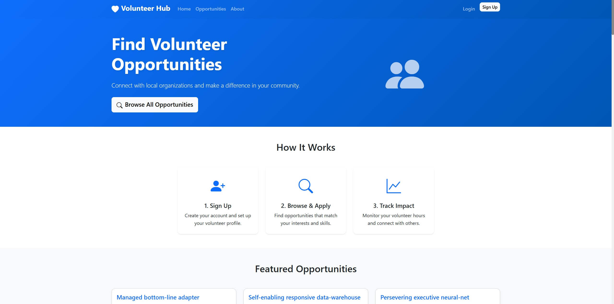

# Volunteer Hub - Community Service Connector

## Description

VolunteerHub is a full-stack volunteer management platform that connects community-minded individuals with local organizations that need their help. Whether you're looking to volunteer for a few hours or commit to ongoing service, VolunteerHub helps you discover opportunities that match your interests, skills, and availability.

## Table of Contents

- [Features](#features)
- [Requirements](#requirements)
- [Installation](#installation)
- [Usage](#usage)
- [Deployed Website](#deployed-website)
- [Technologies Used](#technologies-used)
- [Contributions](#contributions)
- [Project Status](#project-status)
- [Contact](#contact)

## Features

### For Volunteers

- **Account Creation & Profile Management**: Create detailed profiles with skills, interests, and availability
- **Opportunity Discovery**: Browse and search volunteer opportunities by location, date, and cause
- **Application System**: Apply for opportunities with personalized messages to organizations
- **Hour Tracking**: Digital check-in/check-out system with automatic hour calculation
- **Impact Dashboard**: Personal dashboard showing total hours contributed and volunteer history
- **SMS Notifications**: Receive important updates and reminders via text message
- **Certificate Generation**: Export verified volunteer hour reports for school or work requirements

### For Organizations

- **Organization Profiles**: Create comprehensive organization pages with mission, contact info, and photos
- **Opportunity Posting**: Post detailed volunteer opportunities with requirements and scheduling
- **Volunteer Management**: Review applications, approve volunteers, and manage attendee lists
- **Hour Verification**: Verify volunteer attendance and approve logged service hours
- **Communication Tools**: Send messages and updates to volunteers
- **Analytics Dashboard**: Track volunteer engagement and program impact metrics

### Platform-Wide Features

- **Responsive Design**: Mobile-friendly interface that works on all devices
- **Secure Authentication**: Protected user accounts with session management
- **Real-time Notifications**: Instant updates on application status and opportunity changes
- **Location-Based Matching**: Find opportunities near you with distance calculations
- **Advanced Search & Filtering**: Filter by date, location, cause area, and time commitment
- **User Reviews**: Rate and review volunteer experiences

## Requirements

### System Requirements

- Node.js (version 14 or higher)
- MySQL (version 8.0 or higher)
- npm (comes with Node.js)

### API Keys Needed

- **Twilio Account**: For SMS notifications (optional but recommended)
- **Google Maps API**: For location services and geocoding (optional)

## Installation

### Node installation on Windows

Please visit [Official Node.js Website](https://nodejs.org/) and download the installer.
Also, be sure to have `git` available in your PATH, `npm` might need it (You can find git [here](https://git-scm.com/)).

### Installation Steps

1. Clone this repository
2. Navigate to the project directory
3. Install dependencies: `npm install`
4. Set up your MySQL database and update the connection configuration
5. Run the schema: `npm run schema`
6. Seed the database (optional): `npm run seed`
7. Start the server: `npm start`

## Usage

VolunteerHub is a comprehensive web application that bridges the gap between volunteers and community organizations, making it easier than ever to find meaningful ways to give back to your local community

## Deployed Website

### [Deployed Link](https://volunteer-project-956e5bea2fc7.herokuapp.com/)

## Technologies Used

- JavaScript
- Node.js
- Express.js
- MySQL
- Sequelize ORM
- Handlebars.js
- Express Session
- bcrypt
- dotenv

## Contributions

Created by Shane Bramble-Wade

## Project Status

Project is: _in progress_

## Contact

Created by [@kranniax](https://twitter.com/kranniax) - feel free to contact
